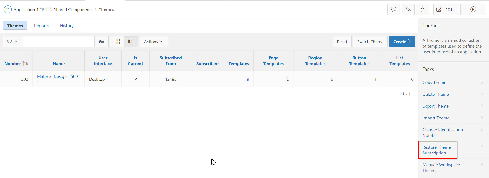
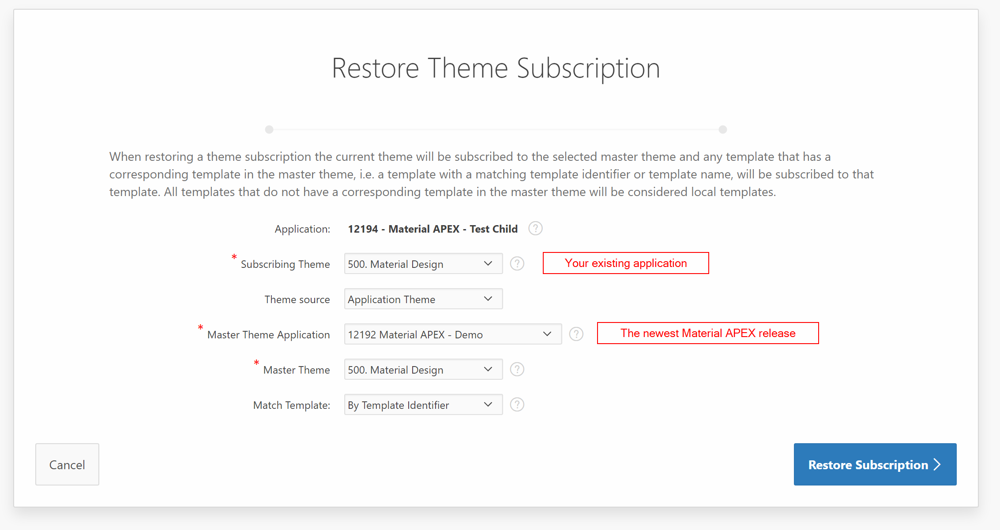

# Update

1. Import `empty-app.sql` from the [latest release](https://github.com/vincentmorneau/material-apex/releases/latest) in your workspace
2. Go to your existing application
3. Go to Shared Components - Themes
4. Select Restore Theme Subscription 
5. Follow the instructions 

---

### Make sure the following components are up to date:
#### Page 0 (optional)
##### Regions
Name | Type | Position | Template | Source
--- | --- | --- | --- | ---
{search bar} | Static Content | Search Bar | *None* |
{sidenav header} | Classic Report | Item Container | *None* | *See Below*

```sql
select '/img/sample-1.jpg' background_img
    , '/img/profile-picture.jpeg' profile_img
    , '#' profile_link
    , 'Vincent Morneau' text_line_1
    , 'vmorneau@insum.ca' text_line_2
from dual
```

##### Items
Name | Type | Label | Region | Template
--- | --- | --- | --- | ---
P0_SEARCH | Text Field | `<i class="material-icons">search</i>` | {search bar} | Standard
